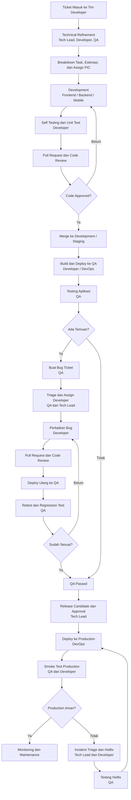

# Development Workflow
## Portal Warga RW

Workflow ini wajib digunakan untuk setiap ticket/feature/bug.



## Stage Rules

### 1. Ticket masuk

Setiap pekerjaan harus memiliki ticket atau user story dengan:

- Tujuan bisnis
- Acceptance criteria
- Scope dan out of scope
- Link design/API/schema bila relevan
- Risiko dan dependency

### 2. Technical refinement

Peserta wajib:

- Tech Lead
- Developer yang akan mengerjakan
- QA

Output:

- Pendekatan teknis
- Dampak ke arsitektur/database/API
- Risiko keamanan
- Strategi testing
- Definition of Done

### 3. Breakdown dan assignment

Task dipecah menjadi task frontend, backend, database, infrastructure, dan QA jika diperlukan. Setiap task memiliki estimasi dan PIC.

### 4. Development

Branch convention:

```text
feature/<ticket>-<short-description>
fix/<ticket>-<short-description>
hotfix/<ticket>-<short-description>
```

Developer wajib:

- Menulis test untuk logic baru
- Menjalankan lint dan unit test
- Tidak commit secret
- Mengikuti permission/RBAC
- Memperbarui dokumentasi jika kontrak berubah

### 5. Pull request dan review

PR minimal berisi:

- Ringkasan perubahan
- Ticket/user story
- Perubahan database/API
- Test yang dijalankan
- Risiko/migration note
- Screenshot untuk perubahan UI

Tidak boleh merge jika code review belum approved.

### 6. QA

QA memverifikasi:

- Acceptance criteria
- Happy path
- Validation/error state
- Permission/RBAC
- Regression area
- Responsive behavior
- Tidak ada kebocoran password/data kesehatan/bukti transfer

Jika ada temuan, QA membuat bug ticket dan flow kembali ke triage.

### 7. Release candidate

Tech Lead memberikan approval hanya jika:

- PR approved
- CI lulus
- QA Passed
- Migration dan environment variable terdokumentasi
- Rollback/hotfix plan tersedia

### 8. Production

Setelah deploy:

- QA dan Developer melakukan smoke test
- Cek login, route utama, API health, dan error log
- Jika aman, masuk monitoring/maintenance
- Jika tidak aman, lakukan incident triage dan hotfix melalui flow yang sama

## Required Commands

```bash
npm run lint
npm run test
npm run build
npm run db:generate
```

## Current project rule

E01-US01 mengikuti flow ini. Implementasi login/registrasi tidak dianggap selesai hanya karena build lulus; tetap membutuhkan PR review, deployment QA, dan QA Passed sebelum release candidate.
