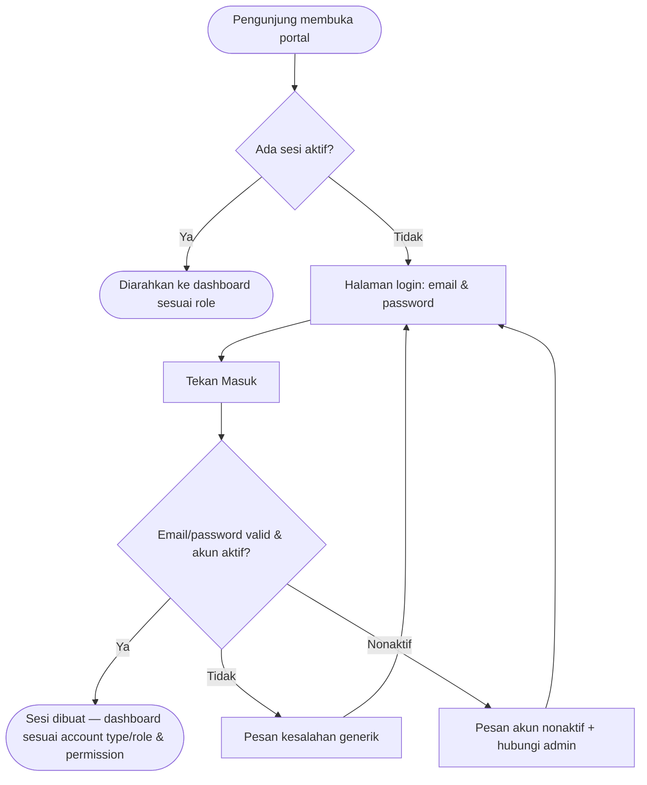

# STORY DESIGN

## Related Story

- Story: `e01-us01--warga-login---story.md`
- Epic: `index.md`
- Status: Draft
- Owner: Resta
- Figma Link: — (desain awal Sprint 0, PEP)

## User Flow



## Wireframe Description

Halaman login satu layar, mobile-first: logo/nama portal di atas, tagline singkat (mis. "Portal Warga RW [nama]"), dua input (email, password dengan toggle lihat), CTA "Masuk" full-width, dan di bawah tautan "Belum punya akun? Daftar" serta teks "Lupa password? Hubungi pengurus RW" beserta kontak admin. Umpan balik (error, loading) muncul di area antara form dan CTA.

## Wireframe

```text
+--------------------------------------------------+
|                    [Logo RW]                     |
|              Portal Warga RW [Nama]              |
|         Informasi & layanan warga terverifikasi  |
|                                                  |
| Email                                         |
| [____________________________]                |
|                                                  |
|  Password                            [lihat]     |
|  [____________________________]                  |
|                                                  |
|  (umpan balik error / info di sini)              |
|                                                  |
|  [              Masuk              ]   <- CTA    |
|                                                  |
|  Belum punya akun / lupa password?               |
|  Hubungi pengurus RW: [nama/kontak admin]        |
+--------------------------------------------------+
```

## UX Interaction Markers

| Marker | Component/Input | User Action | Expected Feedback |
|--------|-----------------|-------------|-------------------|
| UX-01 | CTA "Masuk" | Tap/klik | Loading (tombol nonaktif, spinner) → sesi berhasil: pindah ke dashboard sesuai account type/role & permission; atau pesan error generik di atas CTA |
| UX-02 | Input email & password | Ketik | Validasi inline saat submit: field kosong ditandai + pesan wajib isi |
| UX-03 | Toggle "lihat" password | Tap | Tampilkan/sembunyikan karakter password |
| UX-04 | Teks bantuan "hubungi pengurus RW" | Tap/klik (jika kontak berupa tautan) | Membuka kontak admin (tel/WA) |

## States

### Default
Form kosong fokus pada username; hanya logo, tagline, form, CTA, bantuan — tanpa konten warga.

### Loading
Saat submit: CTA berubah spinner & nonaktif; input dikunci sementara; tidak ada navigasi ganda.

### Empty
Tidak berlaku (form login selalu "siap"); bila portal belum punya konten apa pun, dashboard tetap tampil dengan state kosong masing-masing modul.

### Error
Kredensial salah → pesan generik "Username atau password salah" di atas CTA, field password dikosongkan, fokus kembali ke username. Akun nonaktif → pesan khusus mengarahkan menghubungi admin. Rate limit → pesan "terlalu banyak percobaan, coba lagi dalam beberapa menit".

### Success
Sesi dibuat; pengguna diarahkan otomatis ke dashboard sesuai role (warga → dashboard warga; admin/bendahara → CMS) tanpa layar antara tambahan.

## Open UX Questions

- Nama kontak admin RW di teks bantuan: statis per konfigurasi, atau diambil dari data pengurus? [Usulan: konfigurasi sederhana]
- Apakah perlu halaman "tentang portal" publik sebelum login, atau cukup halaman login yang bersih? [TBD Sprint 0]

---

<!--
FILE LOCATION: docs/features/phase-01-mvp-portal-warga/e-01---autentikasi-akun/e01-us01--warga-login---design.md

RELATED FILES:
- e01-us01--warga-login---story.md
- e01-us01--warga-login---testing.md
-->
