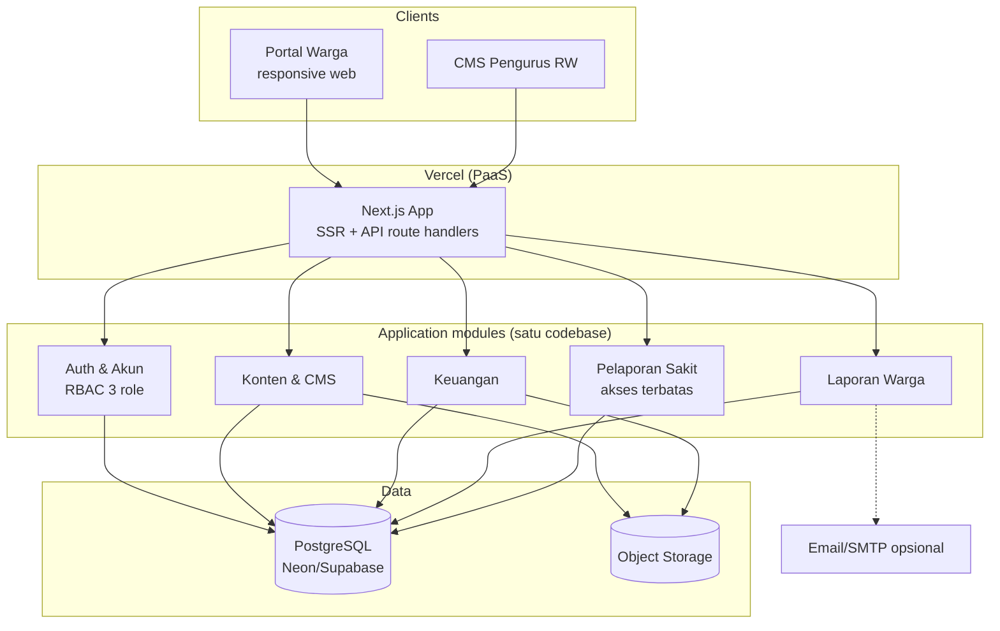
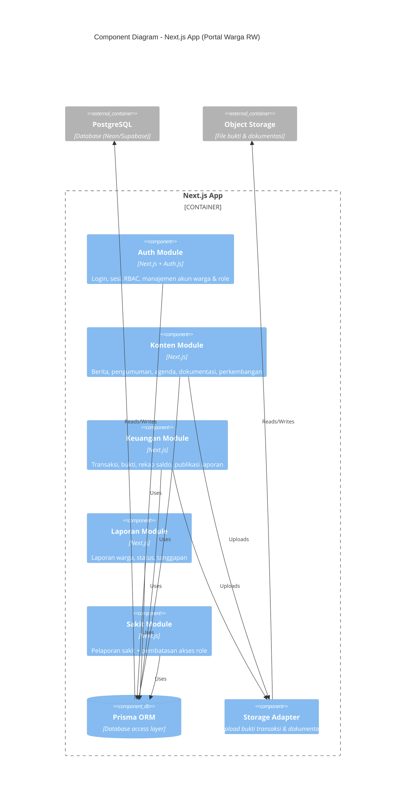
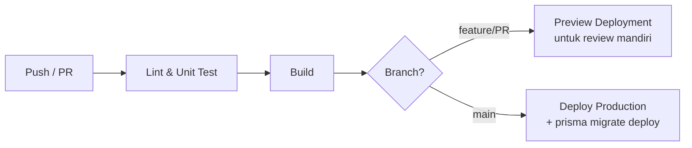

# IMPLEMENTATION & TECHNICAL ARCHITECTURE
## Portal Warga RW

---

| Attribute | Value |
|-----------|-------|
| Document ID | ITA-PWR-001 |
| Version | 1.0 |
| Status | Draft |
| Author | Resta |
| Created | 2026-09-20 |
| Last Updated | 2026-09-20 |

---

## Changelog

| Version | Date | Author | Changes |
|---------|------|--------|---------|
| 1.0 | 2026-09-20 | Resta | Initial draft berdasarkan BRD-PWR-001 v1.0 dan PEP-PWR-001 v1.0 |

---

## 1. Architecture Principles

| Principle | Description | Rationale |
|-----------|-------------|-----------|
| Kesederhanaan (Simplicity First) | Modular monolith tunggal — tanpa microservices, tanpa message queue, tanpa cache terpisah | Dikembangkan solo 10–20 jam/minggu; setiap komponen tambahan = beban operasional yang tidak sebanding dengan skala satu RW |
| Security & Privacy by Design | Akses data komunitas tetap dibatasi melalui autentikasi, verifikasi akun, dan RBAC; pendaftaran warga tersedia dari portal tetapi akses data sensitif tetap dibatasi | Detail kesehatan warga adalah data pribadi sensitif (UU PDP, BRD §6 NFR); salah tampilkan = dampak privasi nyata |
| Biaya Operasional Minimal | Infrastruktur berbasis PaaS free tier; tanpa server yang harus di-maintain | Proyek sosial tanpa anggaran (BRD §7.1); biaya bulanan ≈ Rp0 kecuali domain |
| Maintainability untuk Solo Dev | Satu bahasa (TypeScript) end-to-end, struktur folder modular per domain, dokumentasi seiring kode | Satu orang memegang semua peran (PEP §2.2); ongkos konteks-switch harus ditekan |
| Evolusi Bertahap | Arsitektur tidak menghalangi penambahan kemampuan masa depan (mobile app, iuran online) tapi tidak membangunnya lebih awal | MoM §6: responsive web dulu; YAGNI untuk fitur out-of-scope |

---

## 2. System Architecture

### 2.1 High-Level Architecture (ASCII)

```
┌─────────────────────────────────────────────────────────────┐
│                        CLIENTS                               │
│   Responsive Web (satu codebase, dua area utama)            │
│   ┌──────────────────────┐   ┌───────────────────────────┐ │
│   │  Portal Warga        │   │  CMS Pengurus RW          │ │
│   │  (public-ish + login)│   │  (super admin/admin/      │ │
│   │                      │   │   operasional)            │ │
│   └──────────┬───────────┘   └────────────┬──────────────┘ │
│              │          smartphone / tablet / desktop       │
├──────────────┴─────────────────────────────┴────────────────┤
│                    VERCEL (PaaS)                             │
│              Next.js App (SSR + route handlers)              │
│              • TLS termination • CDN edge • preview deploy   │
├──────────────────────────────────────────────────────────────┤
│                    APPLICATION (modular monolith)            │
│  ┌─────────┐ ┌─────────┐ ┌──────────┐ ┌─────────┐ ┌──────┐ │
│  │  Auth & │ │ Konten  │ │ Keuangan │ │ Laporan │ │Sakit │ │
│  │  Akun   │ │ & CMS   │ │          │ │ Warga   │ │      │ │
│  │ (RBAC)  │ │         │ │          │ │         │ │(akses│ │
│  │         │ │         │ │          │ │         │ │ blkg)│ │
│  └─────────┘ └─────────┘ └──────────┘ └─────────┘ └──────┘ │
├──────────────────────────────────────────────────────────────┤
│                       DATA LAYER                             │
│   ┌──────────────┐         ┌───────────────────────────┐   │
│   │ PostgreSQL   │         │ Object/Blob Storage       │   │
│   │ (Neon/       │         │ (bukti transaksi,         │   │
│   │  Supabase)   │         │  dokumentasi kegiatan)    │   │
│   └──────────────┘         └───────────────────────────┘   │
├──────────────────────────────────────────────────────────────┤
│                   EXTERNAL SERVICES                          │
│         [Email/SMTP — opsional, notifikasi laporan]          │
└──────────────────────────────────────────────────────────────┘
```

**Catatan penyederhanaan dibanding template referensi:** tidak ada API gateway terpisah (Vercel + Next.js route handlers sudah menangani routing/TLS), tidak ada Redis/queue (traffic satu RW rendah; notifikasi email — jika diaktifkan — dikirim in-line/scheduled), tidak ada load balancer terpisah (PaaS menangani).

### 2.2 Architecture Diagram (Mermaid)



### 2.3 Component Diagram



---

## 3. Technology Stack

### 3.1 Core Technologies

| Layer | Technology | Version | Purpose |
|-------|------------|---------|---------|
| **Frontend & Backend** | Next.js (App Router, TypeScript) | 15.x | Responsive web + API route handlers dalam satu codebase |
| **ORM** | Prisma | 6.x | Akses database, migrasi skema, type-safe |
| **Database** | PostgreSQL | 16.x (managed) | Primary data store — hosted Neon atau Supabase |
| **Authentication** | Auth.js (NextAuth v5) | 5.x | Registrasi warga dari portal, login credentials berbasis email/password, sesi, dan RBAC |
| **Styling** | Tailwind CSS | 4.x | Responsive UI (mobile-first) tanpa framework CSS berat |
| **Hosting** | Vercel | — | Deploy web, preview per branch, CDN edge |
| **Object Storage** | Supabase Storage / Vercel Blob | — | Bukti transaksi & dokumentasi kegiatan |

### 3.2 Supporting Technologies

| Category | Technology | Purpose |
|----------|------------|---------|
| Testing (unit) | Vitest | Unit test logika inti (saldo keuangan, transisi status, RBAC) |
| Testing (E2E) | Playwright | Smoke test E2E per sprint (PEP §8.2) |
| Lint & Format | ESLint + Prettier | Konsistensi kode solo dev |
| Email | Resend / SMTP gratisan | Notifikasi laporan baru — opsional, diaktifkan sesuai kebutuhan |
| Monitoring | Vercel Analytics + log | Error & traffic ringan (cukup untuk skala RW) |

### 3.3 Development Tools

| Tool | Purpose |
|------|---------|
| Git + GitHub (private repo) | Version control |
| VS Code | IDE |
| Vercel CLI | Deploy manual & log streaming |

> **Rationale keputusan stack** (dipilih via diskusi arsitektur, 2026-09-20): satu bahasa TypeScript end-to-end menekan ongkos konteks-switch solo dev; Next.js full-stack menghilangkan dua codebase/backend terpisah; ekosistem Auth.js + Prisma mempercepat fondasi RBAC. Alternatif yang dipertimbangkan: NestJS + SPA terpisah (overhead dua codebase), Laravel (ekosistem berbeda dari tooling repo), Next.js + Supabase-BaaS penuh (kontrol arsitektur terbatas untuk logika RBAC/data kesehatan).

---

## 4. Data Architecture

### 4.1 Database Strategy

| Aspect | Decision |
|--------|----------|
| Database Type | Relational (PostgreSQL) — data transaksional keuangan menuntut konsistensi |
| Schema Strategy | Single schema, single-tenant (satu RW) |
| Migration Tool | Prisma Migrate |
| Backup Strategy | Backup otomatis provider (Neon point-in-time restore / Supabase daily) — free tier |
| Retensi | Data kesehatan disimpan selama mungkin sesuai keputusan operasional saat ini; kebijakan retensi formal dapat diperbarui kemudian sesuai kebutuhan RW dan evaluasi UU PDP |

### 4.2 Core Entities (High-Level)

```mermaid
erDiagram
    USER ||--o{ NEWS : "dibuat oleh"
    USER ||--o{ AGENDA_EVENT : "dibuat oleh"
    USER ||--o{ DOCUMENTATION : "diupload oleh"
    USER ||--o{ PROGRAM_UPDATE : "dibuat oleh"
    USER ||--o{ TRANSACTION : "diinput oleh"
    USER ||--o{ FINANCE_REPORT : "disusun oleh"
    USER ||--o{ CITIZEN_REPORT : "dikirim oleh"
    USER ||--o{ REPORT_RESPONSE : "ditanggapi oleh"
    USER ||--o{ SICK_REPORT : "dikirim oleh"

    USER {
        uuid id PK
        string nama
        string username
        string password_hash "hash only, never exposed"
        enum role "super_admin | admin | operasional"
        enum status "menunggu_verifikasi | aktif | nonaktif"
        string alamat "opsional - identifikasi warga"
        string email "nullable, salah satu dari email/phone wajib"
        string phone "nullable, unik jika diisi"
        timestamp phone_verified_at
        timestamp email_verified_at
    }

    NEWS {
        uuid id PK
        string judul
        text isi
        enum jenis "berita | pengumuman"
        timestamp published_at
    }

    AGENDA_EVENT {
        uuid id PK
        string judul
        timestamp tanggal_mulai
        timestamp tanggal_selesai
        string lokasi
    }

    DOCUMENTATION {
        uuid id PK
        string judul
        string storage_path "file di object storage"
        uuid agenda_id FK "opsional - terkait kegiatan"
    }

    PROGRAM_UPDATE {
        uuid id PK
        string judul
        text isi
        timestamp published_at
    }

    TRANSACTION {
        uuid id PK
        enum jenis "pemasukan | pengeluaran"
        decimal nominal
        string kategori
        text deskripsi
        date tanggal
        string bukti_path "opsional - object storage, internal-only"
        enum payment_method "cash | transfer"
        uuid created_by FK
        uuid updated_by FK
    }

    FINANCE_REPORT {
        uuid id PK
        string periode "mis. 2026-11"
        jsonb ringkasan "saldo, total masuk-keluar"
        enum status "draft | menunggu_persetujuan | disetujui | dipublikasikan | dikunci"
        uuid approved_by FK
        timestamp approved_at
        uuid published_by FK
        timestamp published_at
    }

    CITIZEN_REPORT {
        uuid id PK
        enum jenis "laporan | keluhan | aspirasi | bantuan"
        text isi
        enum status "terkirim | ditinjau | diproses | selesai | tidak_dapat_diproses"
        timestamp created_at
    }

    REPORT_RESPONSE {
        uuid id PK
        uuid citizen_report_id FK
        text isi
        timestamp created_at
    }

    SICK_REPORT {
        uuid id PK
        text kondisi "ringkas - tanpa detail medis"
        text detail_kesehatan "AKSES TERBATAS - hanya pengurus berwenang"
        boolean butuh_bantuan
        enum status "aktif | ditindaklanjuti | selesai"
        timestamp created_at
    }
```



> **Note:** Entitas & field di atas adalah gambaran high-level untuk keperluan arsitektur. Detail field, validasi, dan indeks didefinisikan per fitur di SPEC-Technical (`/pm:feature`).

**Catatan desain privasi (EPIC-005 / FEAT-023):** `SICK_REPORT.detail_kesehatan` dipisahkan dari field ringkasan agar pembatasan akses bisa ditegakkan di layer query (select per-field berdasarkan permission), bukan hanya di UI. Warga dan Operasional tanpa permission tidak melihat field ini. Akses detail dicatat di audit log dan audit log hanya dapat dilihat Super Admin.

**Aturan laporan warga:** pelapor tidak dapat menghapus laporan, tetapi dapat mengedit laporan sendiri selama status belum `selesai` atau `tidak_dapat_diproses`. Semua perubahan menyimpan `updated_at` dan actor perubahan.

### 4.3 Caching Strategy

| Data Type | Cache Location | TTL | Invalidation |
|-----------|----------------|-----|--------------|
| Halaman konten publik-ish | Next.js ISR / Vercel edge | 60 detik | Revalidate on publish (revalidatePath/revalidateTag) |
| Sesi pengguna | Auth.js session (cookie, signed) | 30 hari | On logout / role change |
| Data transaksional (keuangan, laporan) | Tanpa cache — selalu dari DB | — | N/A (traffic rendah, konsistensi diutamakan) |

> Tidak ada Redis — skala satu RW (ratusan akun, traffic kecil) tidak membutuhkan cache terpisah; ISR Next.js cukup untuk konten.

---

## 5. API Architecture

### 5.1 API Conventions

| Aspect | Standard |
|--------|----------|
| Style | REST via Next.js route handlers + server actions untuk form mutasi |
| Base URL | `/api/v1` |
| Versioning | URL path (`/v1`) |
| Naming | kebab-case, plural nouns (`/api/v1/finance-reports`) |
| Authentication | Session cookie (Auth.js) — httpOnly, signed |
| Authorization | Middleware RBAC per route/server action |
| Documentation | Komentar JSDoc + daftar endpoint di repo (OpenAPI penuh dianggap berlebihan untuk ukuran ini — [Usulan]) |

### 5.2 Endpoint Overview (High-Level)

> Detail kontrak per endpoint didefinisikan di SPEC-Technical per fitur. Peta module → resource:

| Module | Resource utama (contoh) |
|--------|------------------------|
| Auth & Akun | `/api/v1/auth/*`, `/api/v1/admin/users` |
| Konten & CMS | `/api/v1/news`, `/api/v1/agenda`, `/api/v1/documentations`, `/api/v1/program-updates` |
| Keuangan | `/api/v1/transactions`, `/api/v1/finance-reports`, `/api/v1/finance-reports/{id}/export?format=pdf-or-xlsx` |
| Laporan Warga | `/api/v1/citizen-reports`, `/api/v1/citizen-reports/{id}/responses` |
| Sakit | `/api/v1/sick-reports` |

### 5.3 Standard Response Format

**Success:**
```json
{
  "success": true,
  "data": { },
  "meta": { "page": 1, "limit": 10, "total": 42 }
}
```

**Error:**
```json
{
  "success": false,
  "error": {
    "code": "VALIDATION_ERROR",
    "message": "Nominal transaksi wajib diisi",
    "details": []
  }
}
```

---

## 6. Security Architecture

### 6.1 Authentication & Authorization

| Aspect | Implementation |
|--------|----------------|
| Auth Method | Session cookie httpOnly (Auth.js credentials provider) — warga dapat mendaftar dari portal menggunakan email dan password sendiri; pengurus mengelola verifikasi/status akun dan role pengurus |
| Session TTL | 30 hari (warga jarang login; keseimbangan keamanan vs kenyamanan) |
| Password Hashing | bcrypt (cost 12) |
| Authorization | Role-Based Access Control (RBAC) — middleware + guard per route/action |
| Rate Limiting | Ringan via Vercel middleware (login & pengiriman laporan) |

### 6.2 Security Measures

- [x] HTTPS everywhere (TLS otomatis Vercel)
- [x] Rate limiting login (anti brute-force) & form pengiriman laporan
- [x] Input validation & sanitization (Zod di server actions/route handlers)
- [x] SQL injection prevention (Prisma parameterized)
- [x] XSS prevention (React output encoding default; sanitize rich-text konten)
- [x] Security headers (CSP, HSTS via `next.config` / Vercel)
- [x] Upload restriction (tipe & ukuran file bukti/dokumentasi)
- [x] Audit log: login berhasil/gagal, pembuatan akun, verifikasi akun, perubahan kontak, perubahan role/permission, perubahan transaksi, persetujuan/publikasi laporan keuangan, perubahan status laporan, dan akses detail kesehatan
- [x] Audit log hanya dapat dilihat oleh Super Admin

### 6.3 Role Definitions

| Role/Account Type | Description | Access Level |
|------|-------------|--------------|
| Super Admin | Role pengurus dengan akses tertinggi | Kelola role/permission; menyetujui dan mempublikasikan laporan keuangan; akses audit log; akses detail kesehatan sesuai permission |
| Admin | Role pengurus untuk administrasi dan layanan warga | Kelola akun warga sesuai kewenangan; kelola konten; proses laporan warga; akses detail kesehatan hanya jika ditugaskan |
| Operasional | Role pengurus untuk pekerjaan operasional | Mengelola transaksi dan tindak lanjut layanan sesuai permission; tidak dapat melihat audit log; tidak otomatis dapat melihat detail kesehatan |
| Warga | Account type, bukan role pengurus | Membaca konten dan laporan keuangan terpublikasi; mengirim/memantau laporan sendiri; mengedit laporan sendiri sesuai status; mengirim laporan sakit sendiri |
| (Tanpa login) | Publik | Tidak ada akses data komunitas; hanya halaman login/info minim |

> Detail data kesehatan menggunakan permission khusus, bukan asumsi bahwa semua pengurus boleh melihatnya. Role dapat diberi atau dicabut permission tersebut tanpa mengubah arsitektur RBAC.

### 6.4 UU PDP Compliance

- Data pribadi yang dikumpulkan dibatasi minimum yang diperlukan identifikasi warga (nama, alamat, kontak).
- Data kesehatan (`SICK_REPORT`) dikategorikan sensitif: akses dibatasi role, tidak di-expose ke API publik, tidak masuk cache/ISR.
- Persetujuan pengguna & kebijakan privasi sederhana ditampilkan saat login pertama [Usulan — konfirmasi RW].
- Hak akses/perubahan data warga dijalankan oleh Admin sesuai kewenangan dan dapat dieskalasikan ke Super Admin.
- Password tidak pernah dapat dilihat atau dipulihkan dalam bentuk plaintext oleh pengurus.
- Pergantian nomor telepon menggunakan internal immutable user ID + OTP ke nomor baru. Jika nomor lama tidak dapat diakses, lakukan verifikasi manual menggunakan identitas/alamat sesuai kebijakan RW.
- Bukti transfer dan dokumen identitas tidak boleh masuk response warga atau cache publik.

---

## 7. Development Environment

### 7.1 Quick Start

```bash
# 1. Clone & setup
git clone [repository-url]
cd portal-warga-rw
npm install
cp .env.example .env

# 2. Siapkan database provider pilihan Sprint 0 & isi DATABASE_URL di .env

# 3. Migrasi + data contoh
npx prisma migrate dev
npm run db:seed

# 4. Jalankan
npm run dev
# - Web: http://localhost:3000
```

### 7.2 Script Commands

| Command | Description |
|---------|-------------|
| `npm run dev` | Development server |
| `npm run build` | Production build |
| `npm run lint` | ESLint + Prettier check |
| `npm run test` | Vitest (unit) |
| `npm run test:e2e` | Playwright (E2E smoke) |
| `npm run db:migrate` | Prisma migrate deploy |
| `npm run db:seed` | Isi data contoh (akun uji 3 role, konten, transaksi) |

### 7.3 Environment Variables

Lihat `.env.example`. Kategori utama:

| Category | Variables | Description |
|----------|-----------|-------------|
| **App** | `NODE_ENV`, `APP_URL` | Application settings |
| Database | `DATABASE_URL` | PostgreSQL provider yang dipilih pada Sprint 0 |
| **Auth** | `AUTH_SECRET`, `AUTH_URL` | Auth.js session signing |
| **Storage** | `BLOB_/SUPABASE_*` | Object storage (bukti & dokumentasi) |
| **External** | `EMAIL_*` | SMTP/Resend — opsional |

> **Note:** Jangan commit `.env`. Gunakan `.env.example` sebagai template.

---

## 8. DevOps & Deployment

### 8.1 Environments

| Environment | Purpose | Implementasi |
|-------------|---------|--------------|
| Development | Lokal (laptop Resta) | `npm run dev` + DB dev Neon branch |
| Preview/Staging | Review sebelum produksi, demo ke Pak Jono tiap akhir sprint (PEP §6.1) | Vercel Preview Deployment per PR/branch |
| Production | Live system | Vercel production + DB branch produksi (Neon/Supabase) |

> Staging = Vercel preview deployment — tidak perlu server staging terpisah. Database staging memakai branch terpisah dari database produksi (fitur branching Neon memungkinkan).

### 8.2 CI/CD Overview



CI ringan via GitHub Actions: lint → test → build pada setiap push; deploy ditangani Vercel (preview per PR, produksi saat merge ke `main`).

### 8.3 Branching Strategy

| Branch | Purpose | Deploys To |
|--------|---------|------------|
| `main` | Kode siap produksi | Production (Vercel) |
| `feature/*` | Pengembangan fitur per sprint | Preview deployment |

> Trunk-based sederhana — cocok untuk solo dev. PR ke `main` dipakai sebagai self-review gate (PEP §8.1), bukan review orang lain. Tanpa branch `develop` terpisah.

### 8.4 Biaya Operasional (Estimasi)

| Item | Biaya/bulan | Catatan |
|------|-------------|---------|
| Vercel (Hobby) | Rp0 | Non-commercial, cukup untuk traffic RW |
| Neon/Supabase free tier | Rp0 | Batas penyimpanan free tier jauh di atas kebutuhan RW |
| Domain `.id`/`.com` | ~Rp15–30rb | Satu-satunya biaya tetap; konfirmasi pilihan & kepemilikan domain dengan Pak Jono (D04 PEP) |

> Estimasi total ≈Rp0–30rb/bulan. Angka final menjadi bagian usulan infrastruktur Sprint 0 untuk dikonfirmasi Pak Jono (PEP D04).

---

## 9. Coding Standards

### 9.1 Naming Conventions

| Item | Convention | Example |
|------|------------|---------|
| Files & folders | kebab-case | `finance-report-actions.ts` |
| React components | PascalCase | `TransactionForm.tsx` |
| Functions | camelCase | `createTransaction()` |
| Variables | camelCase | `saldoAkhir` |
| Constants | SCREAMING_SNAKE | `MAX_UPLOAD_MB` |
| Database tables | snake_case | `finance_reports` |
| API endpoints | kebab-case | `/api/v1/finance-reports` |

> UI copy dalam Bahasa Indonesia (sesuai pengguna portal); identifier kode dalam Bahasa Inggris.

### 9.2 Commit Convention

```
<type>(<scope>): <subject>

Types:
- feat: New feature
- fix: Bug fix
- docs: Documentation
- refactor: Code restructuring
- test: Adding tests
- chore: Maintenance

Example:
feat(finance): implement transaction input with proof upload
```

### 9.3 Self-Review Checklist (sebelum merge ke main — DoD PEP §8.1)

- [ ] Lint & format lulus
- [ ] Unit test logika bisnis (keuangan/status/RBAC) lulus
- [ ] Validasi input di sisi server (Zod)
- [ ] Cek akses role/permission untuk route/action baru (warga ≠ operasional ≠ admin ≠ super admin)
- [ ] Tidak ada data sensitif (kesehatan, password) yang bocor ke log/respons
- [ ] Responsive check (mobile + desktop)
- [ ] Dokumentasi terkait ter-update

---

## 10. Approval

| Role | Name | Signature | Date |
|------|------|-----------|------|
| Solution Architect / Developer | Resta | | |
| PIC Client | Pak Jono | | |

---

## Related Documents

| Document | Description |
|----------|-------------|
| `mom/MoM_Portal_Warga_RW_Pak_Jono.md` | Sumber kebutuhan awal |
| `docs/project/portal-warga-rw/01-BRD.md` | Business requirements |
| `docs/project/portal-warga-rw/02-PEP.md` | Project execution plan |
| `docs/features/*/*-feature---technical.md` | Feature technical specs (akan dibuat via `/pm:feature`) |
